# Walkthrough: Knight Knowledge Base Generation

The **Knight Knowledge Base** has been fully generated. This repository serves as the permanent memory and identity system for your AI assistant, Knight.

## Repository Overview

The following core components have been implemented as professional engineering specifications:

### 1. The Constitutional Layer
- [Knight_Blueprint.md](file:///C:/Users/tejas/knight_os/knight_knowledge_base/01_Blueprint/Knight_Blueprint.md): Defines the mission, identity, and ethics of Knight.

### 2. The Ontology & Inquiry Layer
- [Master_Memory.md](file:///C:/Users/tejas/knight_os/knight_knowledge_base/02_Master_Memory/Master_Memory.md): A universal ontology of 30 domains for human life.
- [Question_Bank.md](file:///C:/Users/tejas/knight_os/knight_knowledge_base/03_Question_Bank/Question_Bank.md): 1,100 structured questions designed for high-fidelity life mapping.

### 3. The Intelligence & Reasoning Layer
- [Knowledge_Generator.md](file:///C:/Users/tejas/knight_os/knight_knowledge_base/04_Knowledge_Generator/Knowledge_Generator.md): Logic for synthesizing memory into books.
- [Knowledge_Graph.md](file:///C:/Users/tejas/knight_os/knight_knowledge_base/05_Knowledge_Graph/Knowledge_Graph.md): Causal and semantic relationship specification.
- [Runtime_Architecture.md](file:///C:/Users/tejas/knight_os/knight_knowledge_base/06_Runtime_Architecture/Runtime_Architecture.md): System orchestration manual.

### 4. Operational Engines (Specifications)
- [Memory_Update_Engine.md](file:///C:/Users/tejas/knight_os/knight_knowledge_base/07_Memory_Update_Engine/Memory_Update_Engine.md): Versioning and persistence logic.
- [Memory_Import_Engine.md](file:///C:/Users/tejas/knight_os/knight_knowledge_base/08_Memory_Import_Engine/Memory_Import_Engine.md): Bulk data mapping framework.
- [Evidence_Import_Framework.md](file:///C:/Users/tejas/knight_os/knight_knowledge_base/09_Evidence_Import_Framework/Evidence_Import_Framework.md): Verification and artifact handling.
- [Version_History.md](file:///C:/Users/tejas/knight_os/knight_knowledge_base/10_Version_History/Version_History.md): Temporal logic and rollback protocols.

### 5. Implementation Artifacts
- **Prompt Library**: Five LLM-agnostic prompts for synthesis, conflict resolution, and inquiry.
- **Book Templates**: Standardized structures for the 11 Knowledge Books.
- **Import/Export Templates**: Sample CSV/YAML structures for data mobility.
- **Documentation**: [SYSTEM_MANUAL.md](file:///C:/Users/tejas/knight_os/knight_knowledge_base/16_Documentation/SYSTEM_MANUAL.md) for future developers.

## Repository Structure Diagram

```mermaid
graph TD
    Root[Knight Knowledge Base]
    Root --> 01[01_Blueprint]
    Root --> 02[02_Master_Memory]
    Root --> 03[03_Question_Bank]
    Root --> 04[04_Knowledge_Generator]
    Root --> 05[05_Knowledge_Graph]
    Root --> 06[06_Runtime_Architecture]
    Root --> 07[07_Memory_Update_Engine]
    Root --> 08[08_Memory_Import_Engine]
    Root --> 09[09_Evidence_Import_Framework]
    Root --> 10[10_Version_History]
    Root --> 11[11_Prompt_Library]
    Root --> 12[12_Book_Templates]
    Root --> 14[14_Import_Templates]
    Root --> 15[15_Export_Templates]
    Root --> 16[16_Documentation]
    Root --> Books[books/]
```

> [!NOTE]
> All files are written as implementation-independent engineering specifications, fulfilling the requirement for a professional-grade repository that can be adapted to any future AI model or software stack.

> [!IMPORTANT]
> JSON Schemas have been omitted from this phase per your specific "not yet" instructions, but the data structures they will enforce are fully defined in the Master Memory and Question Bank specifications.
