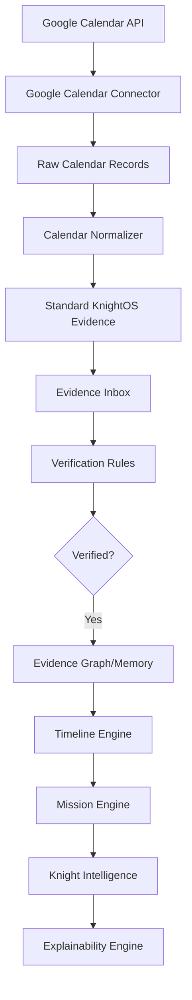

# Revised Engineering Plan - M3-WP4: Google Calendar Connector

This plan implements the Google Calendar integration for KnightOS, strictly adhering to the "Evidence-First" architecture.

## 1. Architecture Compliance Review

- **Status**: Milestone 1, 2, and 3 (WP1-3) are confirmed present and architecturally sound.
- **Compliance Gap**: The current `NormalizationPipeline` projects directly to the `Timeline`.
- **Refinement**: Refactor `NormalizationPipeline` to decouple Ingestion from Projection. Google Calendar data will flow through the `Evidence Inbox` and require verification before appearing on the `Timeline`.

## 2. Proposed System Flow

## 3. Implementation Sequence

### Phase 1: Core refactoring & State
- **[MODIFY]** `NormalizationPipeline`: Remove direct Timeline recording from the `process` loop.
- **[NEW]** `CalendarSyncState`: Model to track `Last Sync`, `Sync Token`, and counters (Imported, Updated, Deleted, etc.).
- **[MODIFY]** `IntegrationHub`: Add support for multi-stage sync status (Syncing -> Normalizing -> Completed).

### Phase 2: Google Calendar Connector
- **[NEW]** `GoogleCalendarConnector`: Implements `IConnector`. Handles OAuth2 and incremental sync logic using `syncToken`.
- **[NEW]** `GoogleCalendarNormalizer`: Maps raw JSON to `Evidence` UDS. Implements classification (Meeting, Work, Personal, etc.).
- **[NEW]** `GoogleCalendarFilter`: Logic to handle user-selected calendars and event exclusions (Declined, Cancelled).

### Phase 3: Evidence & Verification
- **[NEW]** `TimelineProjectionListener`: Listens for `EvidenceVerified` events to trigger `TimelineEngine` projection.
- **[NEW]** `CalendarVerificationRules`: Logic to auto-verify high-confidence calendar imports (e.g., from primary work calendar).

### Phase 4: UI & Explainability
- **[NEW]** `CalendarSettingsScreen`: UI for selecting calendars and sync frequency.
- **[NEW]** `CalendarEvidenceDetail`: Enhanced view showing `Connector ID`, `Google Event ID`, and `Sync Batch`.

## 4. Risks & Mitigations

| Risk | Mitigation |
| :--- | :--- |
| **API Quota Limits** | Implement exponential backoff and batch sync logic. |
| **Token Expiry** | Automatic refresh via `AuthService` integration. |
| **Duplicate Events** | SHA-256 hashing of `EventID + Sequence` for atomic deduplication at the Evidence layer. |
| **Sync Interruptions** | `syncToken` only updated in `ProviderSyncMetadataTable` *after* a batch is successfully normalized and stored as Evidence. |

## 5. Acceptance Criteria

1.  **Evidence Flow**: Calendar events appear in the `Evidence Inbox` as `Pending` before hitting the `Timeline`.
2.  **Sync State**: The `IntegrationHub` reports detailed sync metrics (counts, last sync, tokens).
3.  **Classification**: Events are correctly categorized as `Work`, `Personal`, `Meeting`, etc.
4.  **Filtering**: User-selected exclusions (Declined events) are respected.
5.  **Explainability**: Each timeline event created from a calendar entry links back to a specific `Evidence` record with full Google metadata.

## 6. Infrastructure Reuse Matrix

- **IntegrationHub**: Used for connector lifecycle and sync orchestration.
- **Event Bus**: Used for `SyncStarted`, `SyncCompleted`, and `EvidenceImported` events.
- **Evidence Center**: Used as the primary staging area for all imports.
- **Timeline Engine**: Receives projected events only after verification.
- **Explainability Engine**: Captures the reasoning chain from Google Event -> Evidence -> Timeline.
