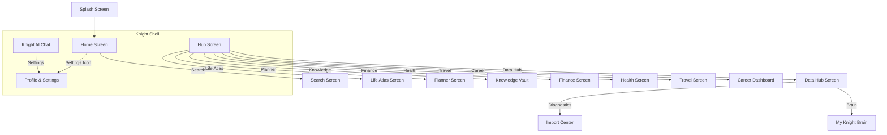

# KNIGHT OS — NAVIGATION MAP

## Verified Routes
- `/` -> SplashScreen
- `/home` -> HomeScreen
- `/dashboard` -> HubScreen
- `/knight` -> KnightChat
- `/data-hub` -> DataHub
- `/planner` -> PlannerHomeScreen
- `/knowledge-vault` -> KnowledgeVaultScreen
- `/finance` -> FinanceTrackerScreen
- `/health` -> HealthDashboardScreen
- `/travel` -> TravelHomeScreen
- `/career` -> CareerDashboardScreen (Crashes)
- `/profile` -> ProfileScreen
