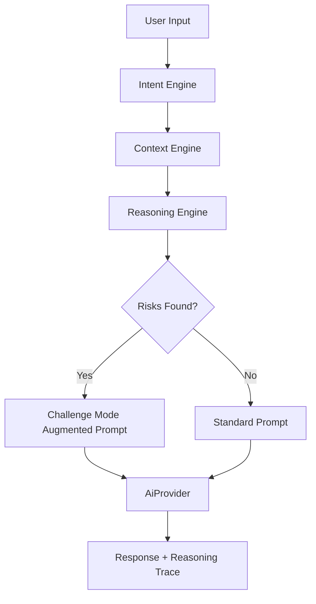

# Walkthrough - KnightOS Cognitive Layer

KnightOS has evolved from a memory-first system into a **Cognitive Operating System**. We have implemented the "Mind" of the OS—a reasoning pipeline that processes context, detects user intent, and protects long-term goals.

## Key Cognitive Capabilities

### 1. Intent Detection
Knight now understands *why* you are talking to it. The `IntentEngine` classifies requests into 9 categories (Decision, Planning, Learning, etc.), which guides how the system assembles context and reasons about the response.

### 2. Tiered Context Pipeline
Instead of flooding the AI with data, the `ContextEngine` now uses a prioritized pipeline:
- **Identity**: Who you are (Core facts).
- **Mission**: What you're doing today (Focus areas).
- **Rules**: Life constraints you've set.
- **Recency**: The latest events.
- **Intent-specific**: Relevant data (e.g., Financial logs for spending decisions).

### 3. Knight Challenge Mode
This is a first-class architectural feature. The `ReasoningEngine` evaluates decisions against your life rules. If a conflict is detected (e.g., spending that exceeds your budget), Knight will:
1. Identify the risk.
2. Formulate a respectful challenge.
3. Suggest alternatives based on your goals.

### 4. Explainability (Reasoning Trace)
Knight no longer gives "black box" answers. Every significant recommendation generates a `ReasoningTrace` that tracks:
- Memories used.
- Rules applied.
- The step-by-step "Thought Chain".
- Confidence levels.

---

## Technical Implementation

### Cognitive Flow

### New Specialist Engines
- **Planning Engine**: Converts goals into actionable steps.
- **Reflection Engine**: Learns from interactions to identify "Lessons Learned".
- **Insight Engine**: Discovers cross-domain trends (e.g., Stress vs. Productivity).
- **Goal Intelligence**: Monitors the health and progress of your long-term milestones.

---

## Verification Results

### Automated Tests
- **Intent Accuracy**: Verified detection of Decision, Planning, and Reminder intents.
- **Conflict Detection**: Confirmed that the `ReasoningEngine` identifies budget violations in decision contexts.

### UI Integration
- **Explainability Sheet**: Users can now tap the "Psychology" icon in Knight Chat to see exactly *why* Knight reached a certain conclusion.
