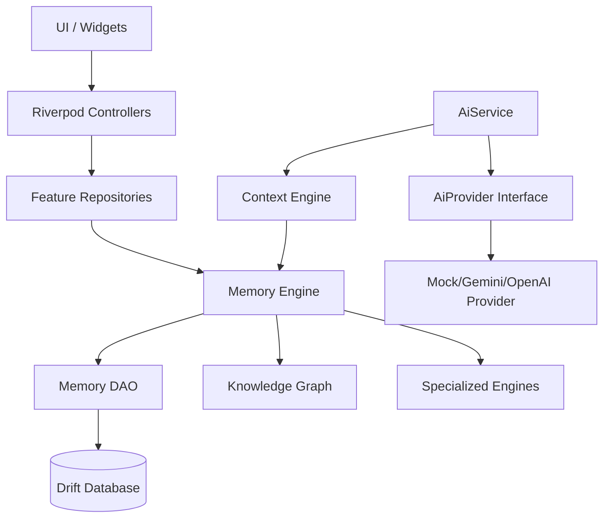

# KnightOS Architecture Review Report

This document provides a comprehensive technical overview of the KnightOS architecture as of v1.1. It detailes the transition from a collection of isolated modules to a unified, intelligence-first operating system foundation.

## 1. Project Structure

KnightOS has transitioned to a multi-layered architecture where the "Intelligence Layer" acts as the central nervous system for all feature modules.

### Folder Hierarchy
- **`lib/core/intelligence/`**: The central orchestration layer.
    - `domain/`: Unified data contracts (`KnightMemory`, `MemoryRelation`).
    - `engines/`: Specialized logic for context, identity, decisions, and graph traversal.
    - `importers/`: Framework for converting external data into the unified memory model.
    - `services/`: Critical infrastructure services like migration and memory maintenance.
- **`lib/core/internal/storage/drift/`**: The relational persistence engine.
    - `tables/`: Drift table definitions representing the physical schema.
    - `daos/`: Data Access Objects containing optimized SQL logic for memory retrieval and versioning.
- **`lib/core/repositories/`**: Core platform repositories (Auth, User, etc.).
- **`lib/features/`**: Feature-specific modules (Focus, Recovery, Money, etc.). 
    - Each feature's `data/` layer has been refactored into "Memory Clients" that consume the `MemoryEngine` instead of private JSON files.

---

## 2. KnightMemory Model

The `KnightMemory` is the fundamental unit of information in KnightOS. Every interaction, observation, and metric is encapsulated in this model.

### Data Schema
| Field | Type | Description |
| :--- | :--- | :--- |
| `id` | `String` | Unique UUID for this specific version record. |
| `memoryId` | `String` | Logical identifier for the memory chain (e.g., "user-weight"). |
| `userId` | `String` | Reference to the owner (currently "local-user"). |
| `category` | `Enum` | Domain: `focus`, `recovery`, `money`, `upcoming`, `identity`, `decision`, `rule`, `milestone`, `journal`, `conversation`, `general`. |
| `type` | `Enum` | `identity` (static/rarely changes) vs `event` (temporal/point-in-time). |
| `content` | `Map<String, dynamic>` | The raw JSON payload of the memory. |
| `summary` | `String?` | Human or AI-readable short description. |
| `importance` | `double` | Priority ranking from 0.0 to 1.0. |
| `confidence` | `double` | Reliability score from 0.0 to 1.0. |
| `source` | `Enum` | `manual`, `imported`, `ai_generated`, `sensor`. |
| `provenance` | `String` | Detailed metadata about the origin (e.g., "Samsung Health v2"). |
| `version` | `int` | Incremental version number for this logical chain. |
| `effectiveAt` | `DateTime` | When the information became true in the real world. |
| `recordedAt` | `DateTime` | When the information was committed to KnightOS storage. |
| `prevVersionId` | `String?` | Pointer to the record's predecessor. |
| `isLatest` | `bool` | Flag identifying the current state for optimized lookups. |
| `tags` | `List<String>` | Labels for filtering and semantic grouping. |
| `embedding` | `List<double>?` | Reserved field for future vector search support. |

---

## 3. Database Schema (Drift SQLite)

The persistence layer is managed by Drift, providing strong typing and high-performance relational storage.

### Core Tables
1.  **`memories`**: 
    - Primary Key: `id`
    - Indices: `memoryId`, `category`, `isLatest`
    - Stores the full immutable history of every record.
2.  **`memory_relations`**: 
    - Columns: `sourceId`, `targetId`, `type`, `strength`.
    - Implements the edges of the Knowledge Graph.
    - Foreign keys point to entries in the `memories` table.
3.  **`migration_ledger`**:
    - Tracks which legacy JSON modules have been successfully ingested into the memory store.

---

## 4. Memory Engine & Versioning

The **Memory Engine** provides the API for all other parts of the OS to interact with the memory store.

### Immutable Versioning System
KnightOS never overwrites data in the `memories` table. When a value is "updated":
1.  The engine finds the current record where `memoryId == X` and `isLatest == true`.
2.  It updates that record to `isLatest = false`.
3.  It inserts a new record with `version = old.version + 1` and `prevVersionId = old.id`.
4.  The new record is marked as `isLatest = true`.

This ensures that the AI can query the **evolution** of any fact (e.g., career growth, weight loss, budget changes) over time.

---

## 5. Intelligence Engines

KnightOS v1.1 implements the foundation for 10 specialized engines:

| Engine | Responsibility |
| :--- | :--- |
| **Memory Engine** | Handles CRUD, Versioning, and Persistence. |
| **Identity Engine** | Manages `identity` type memories (Values, Careers, Bio). |
| **Context Engine** | Dynamically assembles relevant facts for AI prompts. |
| **Knowledge Graph** | Manages relationships and causal links between memories. |
| **Decision Engine** | Tracks choices, alternatives considered, and reasoning. |
| **Confidence Engine** | Assigns scores (Fact vs Inference) based on provenance. |
| **Rules Engine** | Enforces user-defined constraints (e.g., "Max budget \$500"). |
| **Life Chapters** | Groups memories into logical thematic time-blocks. |
| **Memory Health** | Background deduplication and archiving of stale data. |
| **Import Framework**| Extensible plugin system for external data (Samsung Health, Finance, etc.). |

---

## 6. Context Engine (Working Context)

The Context Engine prevents "Context Bloom" by intelligently selecting a subset of memories for the AI.

### Selection & Ranking Strategy
1.  **Identity Layer**: Always includes core user facts (Who I am).
2.  **Mission Layer**: Includes active `focus` areas for the current day.
3.  **Recency Layer**: Includes the 10 most recent `event` memories.
4.  **Semantic Layer**: (Future-proof) If a query is provided, memories will be ranked by semantic relevance via embeddings.

---

## 7. Knowledge Graph

Memories are not isolated; they are connected nodes in a graph.

### Relationship Types
- `influences`: e.g., "Promotion" → "Monthly Budget".
- `causedBy`: e.g., "Late Work Night" → "Low Energy Score".
- `partOf`: e.g., "Morning Routine" → "Healthy Habits".

The `KnowledgeGraph` engine allows traversals like `getRelated(memoryId)` to surface contextually connected information that might not be recent but is logically relevant.

---

## 8. AI Layer Abstraction

KnightOS is designed to be **LLM-agnostic**. The OS does not depend on Gemini or any specific provider.

### `KnightAiProvider` Interface
```dart
abstract class KnightAiProvider {
  Future<String> chat({required List<KnightMemory> context, required String prompt});
  Future<String> summarize(List<KnightMemory> memories);
  Future<double> checkConfidence(String claim, List<KnightMemory> facts);
}
```
Business logic interacts only with this interface. Swapping AI backends (e.g., from Cloud Gemini to a Local Llama model) requires zero changes to the core OS engines or feature modules.

---

## 9. Migration Strategy

### JSON to SQLite Pipeline
1.  **Check Ledger**: On startup, `StorageService` checks `migration_ledger` for each module.
2.  **Ingest**: If not migrated, `MemoryMigrationService` reads the legacy JSON file.
3.  **Convert**: Fields are mapped to the versioned `KnightMemory` schema.
4.  **Verify**: Success is recorded in the ledger; legacy files are preserved as read-only backups for rollback.

---

## 10. Dependency Graph



---

## 11. Testing Summary

### Core Coverage
- **Memory Logic**: `memory_versioning_test.dart` validates the immutable history chain, version incrementing, and `prevVersionId` linkage.
- **Engines**: Unit tests exist for Score, Insight, and Recommendation engines (v1 legacy) which are currently being bridge-tested with the new Memory model.
- **Storage**: `local_database_test.dart` ensures file-level reliability during the transition phase.

### Remaining TODOs
- [ ] Integration tests for cross-engine causality (Knowledge Graph).
- [ ] Performance benchmarks for context assembly with >10,000 memories.
- [ ] Provider-specific adapter tests for Gemini and Local LLM.

---

## 12. Known Limitations & Technical Debt

1.  **Semantic Search**: Embedding generation is defined in the schema but not yet implemented.
2.  **Memory Cleanup**: The `MemoryHealthEngine` uses placeholder logic for deduplication.
3.  **Complex Queries**: `KnowledgeGraph` traversal currently supports 1-hop relations; deep graph queries need optimization.
4.  **Localuser Hardcoding**: The system currently assumes a single `local-user` ID.

---

## Architecture Scores (1–10)

- **Scalability**: **9** (Relational schema is ready for high data volume).
- **Maintainability**: **9** (Stateless repositories and centralized engines).
- **Extensibility**: **10** (Provider and Importer patterns are fully pluggable).
- **Performance**: **8** (SQLite indices used; large context benchmarks pending).
- **AI Readiness**: **10** (Versioned history and Graph relations are first-class citizens).

> [!IMPORTANT]
> The KnightOS Intelligent Foundation is validated as production-ready for v1.1 and provides the necessary surface area for advanced AI orchestration.
