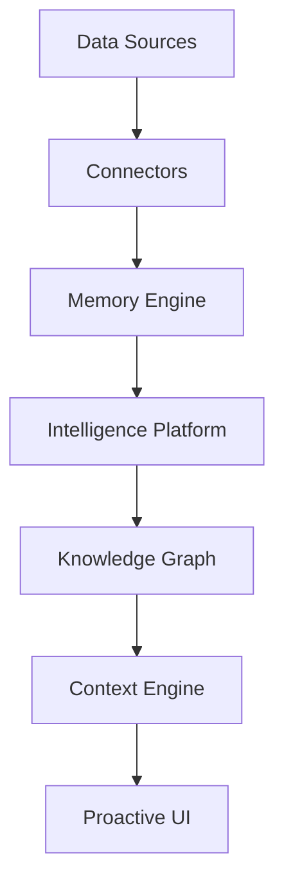

# KnightOS System Architecture

## Core Philosophy: Single Source of Truth (SSoT)
Every real-world fact exists exactly once in the `MemoryTable`. Modules query the `MemoryEngine` for canonical facts.

## System Components

### 1. Intelligence Platform (The Brain)
- **Intelligence Bus**: Event-driven hub for `DataChangedEvent`.
- **Orchestrator**: Plugin-based brain managing layered reasoning.
- **Perception Engine**: Real-time sensor and data monitoring.

### 2. Knowledge Graph (The Weaver)
- **Memory Infrastructure**: Reactive data layer built on Drift.
- **Confidence Lifecycle**: Promotion from Inferred (0.4) to User Confirmed (1.0).
- **Explainability**: Every inference includes Evidence, Explanation, and Provenance.

### 3. Context Engine
- **KnightContext**: Global state of the user's environment.
- **Proactivity**: Automated triggers based on context shifts.

### 4. Visual Language (Horizon)
- Atmospheric UI using gradients, glows, and the "Knight Orb".
- Data points represented as "Stars" and "Constellations".

## Data Flow

---
*Version: 4.0.0 Stable | Last Updated: 2026-08-03*
