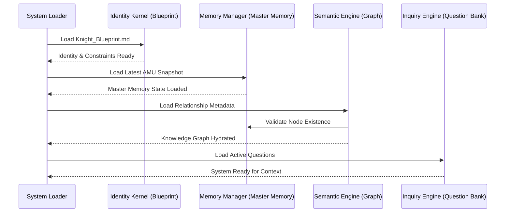
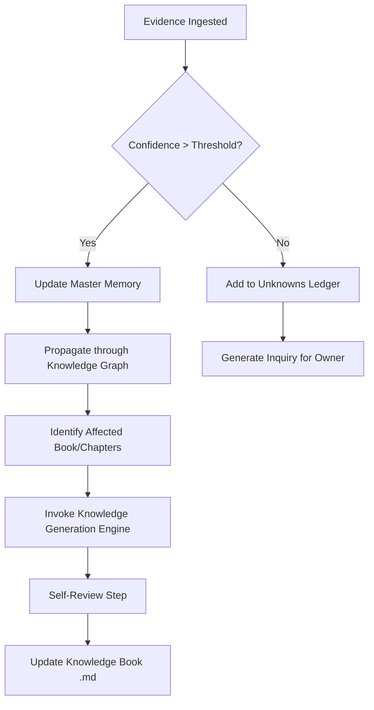

# Runtime Architecture Specification: System Orchestration

**Version:** 1.0.0  
**Status:** Permanent Specification  
**Classification:** System Architecture & Lifecycle Orchestration  
**Date:** 2026-07-27  

---

## 1. Introduction

### 1.1 Purpose
The Runtime Architecture Specification defines the operational dynamics of the Knight Knowledge Base (KKB). It describes how the static specifications (Blueprint, Ontology, Graph) are brought to life by an execution engine. This document serves as the master orchestration manual for any AI or software system implementing the Knight protocol, ensuring that data flow, event handling, and reasoning remain consistent across all life cycles.

### 1.2 Core Components in Runtime
- **Identity Kernel:** Manages the active Blueprint and core constraints.
- **Memory Manager:** Handles CRUD operations on AMUs and versioning.
- **Semantic Engine:** Navigates and maintains the Knowledge Graph.
- **Synthesis Engine:** Operates the Knowledge Generation logic.
- **Inquiry Engine:** Orchestrates questions and processes evidence.

---

## 2. System Lifecycle

### 2.1 Initialization & Startup
Before Knight can interact with the owner, the system must establish its cognitive state.

### 2.2 Processing New Evidence
Evidence is the fuel of the system. Its ingestion is a high-integrity event.

1.  **Ingestion:** Raw data (text, photo, log) enters the system.
2.  **Verification:** The system checks the source against the **Evidence Hierarchy**.
3.  **Atomic Creation:** A new AMU (Atomic Memory Unit) is drafted.
4.  **Graph Mapping:** The system identifies which nodes in the KG are touched by this new data.
5.  **Conflict Check:** The system compares the new AMU with the "Latest" version of existing AMUs for the same MemoryID.

---

## 3. Memory & Version Management

### 3.1 Immutable Append Logic
The system NEVER deletes. Every update is an insertion of a new version.

- **Current State:** Defined as the set of AMUs where `isLatest = true`.
- **Historical State:** All AMUs where `isLatest = false`.
- **Relationship Persistence:** Edges in the KG point to `MemoryID` (logical fact) but can be refined to point to specific `VersionID` (temporal fact) for deep historical analysis.

### 3.2 Confidence Recalculation
Confidence is recalculated whenever:
1.  New evidence is added.
2.  Old evidence is retracted.
3.  A downstream node with high confidence contradicts an upstream node.

---

## 4. Orcherstrating Synthesis (Book Generation)

The generation of the 11 Books is a background process triggered by significant memory updates.

### 4.1 Cascade Updates
A change in a "Root Node" (e.g., Book I: Identity) triggers a **System-Wide Re-validation**. The Runtime Architecture ensures that the system doesn't just update the fact, but re-evaluates every deduction that depended on that fact.

---

## 5. Interaction & Query Processing

When the user (owner) asks a question, Knight does not just search text; it performs a **Semantic Retrieval**.

1.  **Intent Analysis:** What is the owner really asking?
2.  **Context Assembly:** 
    - Fetch direct AMUs.
    - Fetch related nodes from the KG (1-hop and 2-hop).
    - Load relevant "Answer" sections from the 11 Books.
3.  **Reasoning:** Synthesize a response using the active context + Blueprint persona.
4.  **Learning:** If the interaction provides new info, trigger the **Evidence Processing** loop.

---

## 6. Background Maintenance & Health

Knight performs periodic "Cleanup" tasks:
- **Deduplication:** Merging identical AMUs from different sensors.
- **Decay Calculation:** Reducing the "Strength" of edges in the KG that haven't been reinforced by recent evidence.
- **Orphan Hunting:** Identifying facts that are no longer connected to the mission.
- **Audit Logging:** Recording every reasoning step taken by the system into a permanent `audit_log.jsonl`.

---

## 7. Error Recovery & Resilience

### 7.1 Data Integrity Failures
If a JSON schema validation fails during an update:
1.  Roll back to the previous stable VersionID.
2.  Log the failure in the Audit Log.
3.  Alert the owner/administrator of the "Memory Integrity Breach."

### 7.2 Reasoning Paradoxes
If the KG detects a circular dependency or a logical impossibility (e.g., "Owner is in two places at once"):
1.  Freeze the affected nodes.
2.  Create an entry in **Book XI (The Unknown)**.
3.  Generate a high-priority "Truth Resolution" inquiry for the owner.

---

## 8. Scalability Considerations

### 8.1 Context Window Management
As the KKB grows to millions of AMUs, the Runtime Architecture uses **Semantic Tiering**:
- **Hot Tier:** Identity, Active Goals, and recent 24-hour events.
- **Warm Tier:** Contextually relevant KG nodes (via vector search or graph traversal).
- **Cold Tier:** Deep historical archives (only retrieved upon explicit request).

---

## 9. Performance Metrics

The system monitors:
- **Synthesis Latency:** How long it takes for a new fact to appear in a Book.
- **Graph Density:** Number of relationships per fact.
- **Confidence Delta:** How much "Certainty" is growing or shrinking over time.

---

**End of Specification.**
