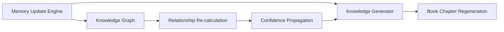

# Memory Update Engine Specification: The Persistence Protocol

**Version:** 1.0.0  
**Status:** Permanent Specification  
**Classification:** Operational Logic & Data Integrity  
**Date:** 2026-07-27  

---

## 1. Introduction

### 1.1 Purpose
The Memory Update Engine (MUE) is the component responsible for the state-change logic of the Knight Knowledge Base. It ensures that every piece of new information is ingested, validated, versioned, and stored according to the **Master Memory Specification** and the **Knight Blueprint**. The MUE is the guardian of the "Ground Truth" and ensures that Knight's memory is both immutable and evolving.

### 1.2 Core Responsibilities
- **Ingestion:** Receiving data from various sources.
- **Validation:** Ensuring data conforms to the required JSON schemas (ontology).
- **Versioning:** Managing the transition from Version N to Version N+1.
- **Deduping:** Merging redundant information.
- **Notification:** Triggering the **Knowledge Graph** and **Knowledge Generator** upon state changes.

---

## 2. Ingestion Pipeline

All new data must pass through the following stages:

1.  **Entry Point:** Data arrives via API, Manual Input, or Sensor Stream.
2.  **Schema Validation:** The data is checked against the relevant Book/Category schema. If it fails, it is rejected with an error log.
3.  **Atomic Identification:** The engine determines if this is a NEW fact or an UPDATE to an existing `MemoryID`.
4.  **Provenance Tagging:** The `SourceType`, `SourceLink`, and `Timestamp` are attached.

---

## 3. Versioning Logic (The N+1 Rule)

Knight uses a **Non-Destructive Update Strategy**.

### 3.1 The Process
When an update for `MemoryID: X` is received:
1.  **Fetch Current:** The engine retrieves the record where `MemoryID == X` and `isLatest == true`.
2.  **Compare:** If the new data is identical to the current data, the update is discarded (No-Op).
3.  **Deprecate:** The existing record's `isLatest` flag is set to `false`.
4.  **Increment:** A new record is created with:
    - `VersionID = UUID()`
    - `VersionNumber = Old.VersionNumber + 1`
    - `PrevVersionID = Old.VersionID`
    - `isLatest = true`
5.  **Commit:** The new record is written to the Master Memory storage.

### 3.2 Immutability Guarantee
Once a `VersionID` is committed, it is never modified. Any correction must result in a new `VersionID`.

---

## 4. Conflict Resolution & Merging

When two updates for the same fact arrive simultaneously or from different sources:

### 4.1 Conflict Matrix
*   **Confidence Priority:** The source with the highest confidence score wins.
*   **Recency Priority:** If confidence scores are equal, the newest timestamp wins.
*   **Manual Override:** If both are equal and the conflict is significant, the MUE freezes the update and requests a "Owner Resolution."

### 4.2 Deduplication Logic
If two AMUs are semantically identical but from different sources:
1.  Create one AMU.
2.  Aggregate both sources into the `provenance` field.
3.  Calculate the **Aggregated Confidence** (usually higher than a single source).

---

## 5. Event Propagation

The MUE does not work in isolation. Every successful update triggers a **State Change Event**:

---

## 6. Audit & Recovery

### 6.1 The Transaction Log
Every operation performed by the MUE is recorded in the `update_audit.jsonl`:
- `timestamp`
- `operation` (INSERT, UPDATE, DEDUP)
- `memory_id`
- `status` (SUCCESS, FAIL)
- `reason` (for failures)

### 6.2 Rollback Protocol
If a "Corruption Event" is detected (e.g., a logic error in the engine):
1.  Identify the "Last Known Good" timestamp.
2.  Reset all `isLatest` flags to the state at that timestamp.
3.  Mark all versions after that timestamp as "Revoked."

---

## 7. Performance & Optimization

### 7.1 Batching
For high-frequency sensor data, the MUE performs **Temporal Aggregation**:
- Collect data for N minutes.
- Create a single "Summary AMU" for that period.
- Store raw logs in the `Archives/` for deep analysis.

### 7.2 Cache Management
The engine maintains a "Hot Fact Cache" of all `isLatest == true` records to ensure sub-millisecond lookups during reasoning.

---

**End of Specification.**
