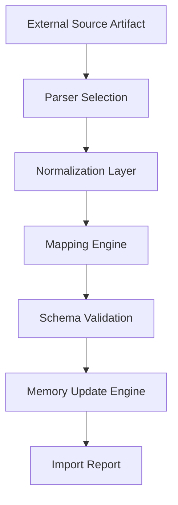

# Memory Import Engine Specification: The Data Ingestion Framework

**Version:** 1.0.0  
**Status:** Permanent Specification  
**Classification:** Data Engineering & Bulk Ingestion  
**Date:** 2026-07-27  

---

## 1. Introduction

### 1.1 Purpose
The Memory Import Engine (MIE) is the "Gateway" for external data entering the Knight Knowledge Base. Its role is to take structured, semi-structured, or unstructured data from outside sources (Bank exports, Social media archives, Health APIs, Legacy JSON files) and map it into the **Master Memory Specification**. 

### 1.2 Core Responsibilities
- **Format Mapping:** Converting CSV, XML, JSON, or TXT into AMUs.
- **Normalization:** Standardizing units (Metric/Imperial), dates (ISO 8601), and terminology.
- **Batch Processing:** Handling thousands of records simultaneously without system degradation.
- **Provenance Assignment:** Automatically linking imported data to its source artifact.

---

## 2. The Import Pipeline

### 2.1 Parser Selection
The MIE uses specialized **Importers** based on the file type:
- `json_importer`: Parses structured object trees.
- `csv_importer`: Handles tabular data (e.g., bank statements, spreadsheets).
- `api_connector`: Streamlines data from external REST/GraphQL endpoints.
- `text_processor`: Extracts entities from unstructured manual notes.

### 2.2 Normalization Layer
Before mapping, data must be "Knight-Standardized":
- **Time:** All timestamps converted to UTC ISO 8601.
- **Value Units:** Standardizing currency (USD/EUR) and measurements (kg/lbs).
- **Strings:** Trimming whitespace, standardizing case for tags.

---

## 3. Mapping Engine (The Translation Logic)

The core of the MIE is the **Mapping Set**. A Mapping Set defines how fields in Source A correspond to domains in the Master Memory.

### 3.1 Example Mapping Logic (Bank Statement)
- `Source.Date` → `AMU.effectiveAt`
- `Source.Amount` → `AMU.content.value`
- `Source.Description` → `AMU.summary`
- `Source.Category` → `AMU.tags` (with a cross-walk to Book IV categories)

### 3.2 Heuristic Mapping
If a field is ambiguous, the MIE uses **Semantic Matching** to guess the target domain.
- *Rule:* Any heuristic match MUST have a confidence score < 0.5 and be flagged for manual review.

---

## 4. Bulk Data Handling

### 4.1 The Import Ledger
Every import job is tracked:
- `job_id`: UUID
- `source_path`: Location of the artifact.
- `records_processed`: Count.
- `success_rate`: %.
- `errors`: List of failed records and reasons.

### 4.2 Deduplication during Import
The MIE checks for **Pre-existing Data** before handing records to the Memory Update Engine.
- *Process:* If a record with the same `effectiveAt` and `content_hash` exists, it is ignored as a duplicate.

---

## 5. Security & Privacy

### 5.1 Scrubbing
Sensitive data (Passwords, full CC numbers) identified during import are **Redacted** or **Hashed** before being stored in the Knowledge Base, unless they belong to an explicitly secure "Secret" domain.

### 5.2 Source Preservation
Original artifacts are never modified. They are moved to the `archives/raw_imports/` directory and linked to the resulting AMUs for permanent auditability.

---

## 6. Error Handling

### 6.1 Partial Success
If an import job contains 1,000 records and 10 fail, the 990 are committed, and the 10 are written to a `quarantine_file.json` for manual correction and re-import.

### 6.2 Schema Evolution
If an imported field has no target in the current Master Memory Specification, the MIE creates a **Shadow Property** and logs a "Schema Expansion Request."

---

**End of Specification.**
