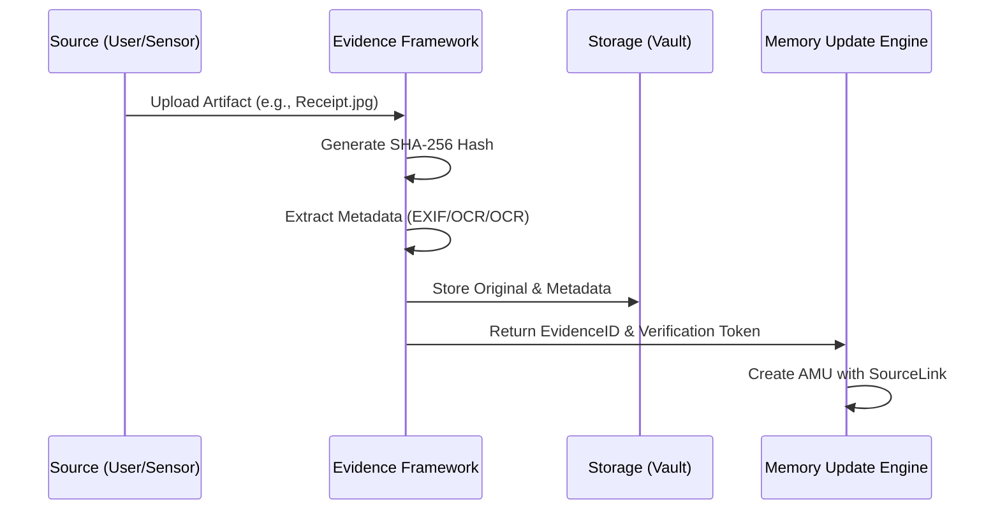

# Evidence Import Framework Specification: The Proof Protocol

**Version:** 1.0.0  
**Status:** Permanent Specification  
**Classification:** Information Integrity & Digital Forensics  
**Date:** 2026-07-27  

---

## 1. Introduction

### 1.1 Purpose
The Evidence Import Framework (EIF) manages the acquisition and storage of the "Artifacts of Truth." Every AMU in the Knight system must be traceable to a source. The EIF defines how these sources (PDFs, JPEGs, JSON logs, raw sensor streams) are captured, hashed, archived, and linked. It is the framework that prevents Knight from "Hallucinating" by ensuring every claim is backed by a verifiable record.

### 1.2 The Principle of "Permanent Proof"
Evidence in Knight is treated as a **Forensic Artifact**. It must be preserved in its original form, uniquely identifiable, and immutable.

---

## 2. Evidence Types

The EIF categorizes evidence into four "Proof Levels":

1.  **Digital Artifacts (Primary):** Original PDF bank statements, signed contracts, raw sensor logs (e.g., Apple Health XML), emails (EML/MSG).
2.  **Visual Evidence (Secondary):** Photos of receipts, screenshots of conversations, video recordings of events.
3.  **Third-Party Attestations:** API responses from trusted services (e.g., Stripe, Plaid, Google Fit).
4.  **Analog/Manual Records:** Scanned hand-written notes, journal entries, direct owner affirmations.

---

## 3. The Evidence Ingestion Loop

---

## 4. Operational Protocols

### 4.1 Integrity & Hashing
- Every file ingested is assigned a **Content-Addressable Identifier (CAID)** based on its SHA-256 hash.
- *Rule:* If two files have the same hash, only one is stored, but both "Appearance Events" are logged.

### 4.2 Metadata Extraction
The EIF performs automatic "Evidence Enrichment":
- **OCR:** Extracts text from images/PDFs.
- **EXIF:** Extracts location, date, and camera data from photos.
- **Header Analysis:** Extracts sender, receiver, and timestamps from emails.

### 4.3 Storage Strategy (The Vault)
Evidence is stored in a **Hierarchical Vault**:
- `evidence/YYYY/MM/DD/[CAID].[ext]`
- Access is strictly controlled.
- Evidence files are encrypted at rest.

---

## 5. Linking & Traceability

### 5.1 The `SourceLink`
Every memory record (AMU) contains a `sourceLink` field.
Format: `knight://evidence/[CAID]#[Segment]`
- `[Segment]` refers to a specific part of the evidence (e.g., Line 42 of a CSV, Page 2 of a PDF, Bounding Box in an image).

### 5.2 Evidence Obsolescence
- *Policy:* Evidence is never deleted.
- *Compression:* After 5 years, high-resolution visual evidence may be transcoded to a lower bitrate to save space, but the original hash is preserved in the audit log for integrity verification.

---

## 6. Verification & Auditing

### 6.1 The "Proof Request"
At any time, the owner can ask: "Knight, why do you know X?"
The system must:
1.  Identify the AMU.
2.  Retrieve the linked Evidence Artifact.
3.  Display the artifact and highlight the specific extraction (OCR snippet/image segment).

### 6.2 Integrity Scanning
A background process periodically re-hashes all evidence in the Vault to ensure no file corruption or tampering has occurred.

---

**End of Specification.**
