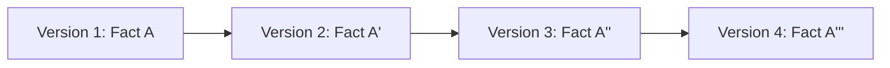

# Version History Specification: The Narrative of Change

**Version:** 1.0.0  
**Status:** Permanent Specification  
**Classification:** Temporal Logic & Auditability  
**Date:** 2026-07-27  

---

## 1. Introduction

### 1.1 Purpose
The Version History specification defines the structure and navigation of the **Knight Memory Changelog**. Unlike traditional databases that only store the "Current Value," Knight stores the entire **Life-Trajectory** of every fact. This document explains how to track, visualize, and revert changes in the owner's knowledge state.

### 1.2 The "Life Trajectory" Concept
Every fact in the Knight Knowledge Base is a **Time-Series**. The system doesn't just know "Current Weight: 80kg"; it knows the path from 75kg to 85kg to 80kg, including the reasons for each change.

---

## 2. Version Record Structure

Every historical record (Snapshot) contains:
- `timestamp`: When the state changed.
- `delta`: What specific fields changed.
- `trigger`: The event that caused the change (e.g., "New Bank Statement Import").
- `reasoning`: Knight's internal logic for accepting the change.
- `predecessor`: Link to the previous `VersionID`.

---

## 3. Navigation Protocols

### 3.1 Time-Travel Queries
The system supports querying memory as it existed at any point in the past.
- *Format:* `getMemory(MemoryID, Timestamp: 2025-01-01)`
- *Logic:* The system finds the AMU with the specified `MemoryID` that was `isLatest` at that specific timestamp.

### 3.2 The "Fact Evolution" View
A chronological list of every version of a specific fact.

*Purpose:* Used by the **Knowledge Generator** to write "Progress Reports" (e.g., "In 2024 your fitness peaked, but then declined until March 2025...").

---

## 4. Rollback & Correction Protocols

### 4.1 Intentional Rollback
If the owner declares a recent update was wrong:
1.  Knight does NOT delete the wrong version.
2.  Knight creates a **New Version** (N+1) that is identical to Version (N-1).
3.  Knight adds a `trigger` note: "Manual Rollback by Owner."

### 4.2 Branching Memory
If two equally plausible truths exist (e.g., "Source A says X, Source B says Y"):
1.  Knight creates two **Temporal Branches**.
2.  Both are stored as part of the history.
3.  The system waits for a "Convergent Evidence Event" to collapse the branch.

---

## 5. Metadata for Change

Every change in the Knowledge Base is classified by **Impact Type**:
- **Correction:** Fixing a typo or incorrect data entry.
- **Evolution:** The fact itself changed in reality (e.g., a promotion).
- **Refinement:** The data became more precise (e.g., moving from "80kg" to "80.42kg").
- **Conflict Resolution:** Reconciling two disagreeing sources.

---

## 6. Audit Logging

Every 24 hours, the system generates a **"Daily State Summary"**:
- Number of facts updated.
- Largest confidence shifts.
- New "Unknowns" identified.
- This summary is stored in **Book VIII (History)**.

---

**End of Specification.**
