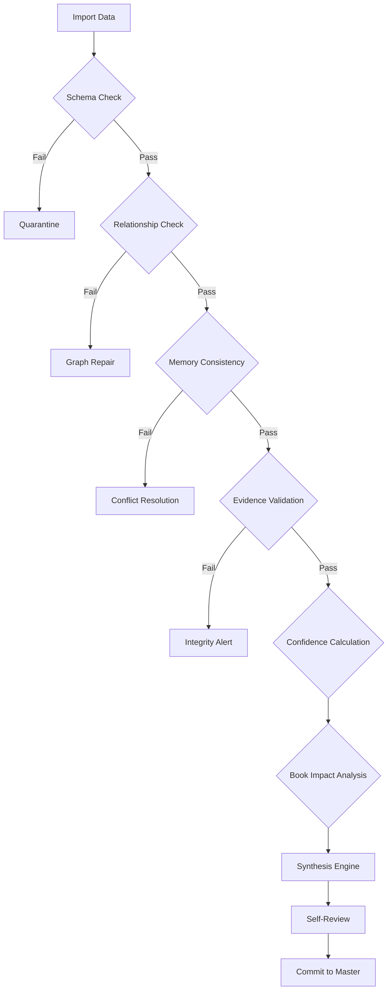

# Validation Pipeline: The Gatekeeper

**Version:** 1.0.0  
**Status:** Permanent Specification  
**Classification:** Operational Logic  
**Date:** 2026-07-27  

---

## 1. Pipeline Overview

The Validation Pipeline is the sequence of checks that any data point must pass before it is committed to the Knight Knowledge Base. It ensures that the repository remains "Production-Quality" at every state change.

---

## 2. Pipeline Stages

### 2.1 Stage 1: Import & Normalization
- Converts raw input into a candidate AMU.
- Assigns a temporary `draftId`.

### 2.2 Stage 2: Schema Validation
- Validates the candidate against the Master Memory JSON schemas.
- Ensures all mandatory fields are present.

### 2.3 Stage 3: Knowledge Graph Insertion
- Inserts the node into a "Shadow Graph."
- Runs the **Cycle Detection** algorithm.
- Identifies downstream nodes for update.

### 2.4 Stage 4: Memory Consistency
- Checks for duplicates and paradoxes against the `isLatest` state.
- Triggers `branching_memory` logic if needed.

### 2.5 Stage 5: Evidence Validation
- Verifies that the CAID in the `sourceLink` exists in the VFS vault.
- Performs hash verification.

### 2.6 Stage 6: Synthesis & Review
- Trigger the **Knowledge Generation Engine**.
- Run the **Self-Review Prompt** to ensure the new data doesn't violate the **Knight Blueprint**.

---

## 3. Commitment Protocol

Only after all stages return **SUCCESS**, the system performs the following:
1.  Set `isLatest: false` on old versions.
2.  Write new version to disk.
3.  Update the `Audit Ledger`.
4.  Invalidate the `Hot Cache`.

---

**End of Specification.**
